# Fill the blanks: before and after

375px, light theme, full page. Taken for the fill-blanks pull request. Each page was also checked at 360px, 390px and 1280px in light and dark.

| Page | Before | After |
|---|---|---|
| 1.6 Task: design an "About me" website |  | 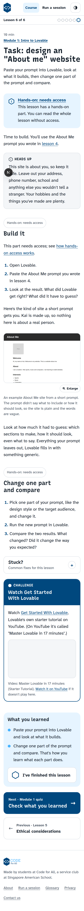 |
| 3.3 Task: install Claude Code |  |  |
| 3.4 Quick business lesson | 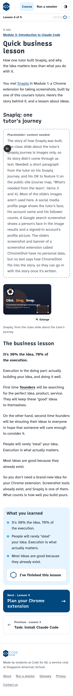 | 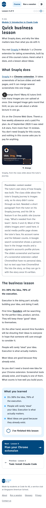 |
| 4.3 How to set up a skill | 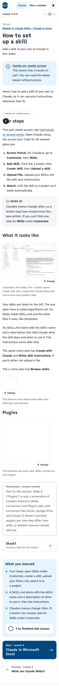 |  |
| 4.4 Claude in Microsoft Excel |  |  |
| 5.2 Export your design | 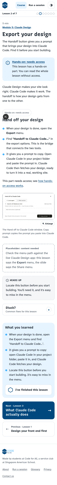 | 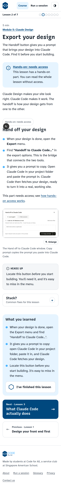 |
| 6.1 What is GitHub? | (unchanged apart from one line) | 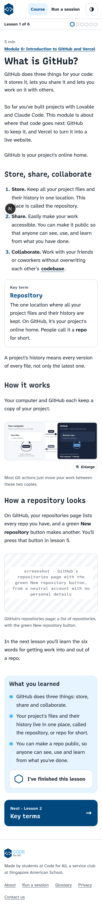 |
| Run a session |  |  |
| Module 9 (coming soon) |  | 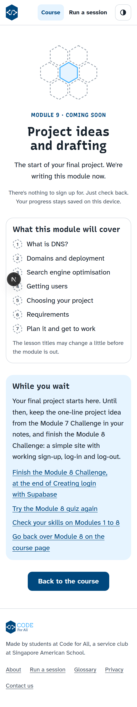 |
| Module 10 (coming soon) |  | 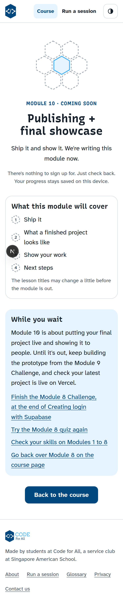 |

The "after" screenshots come from the local dev server, where placeholders still show. On the production site they render nothing.
