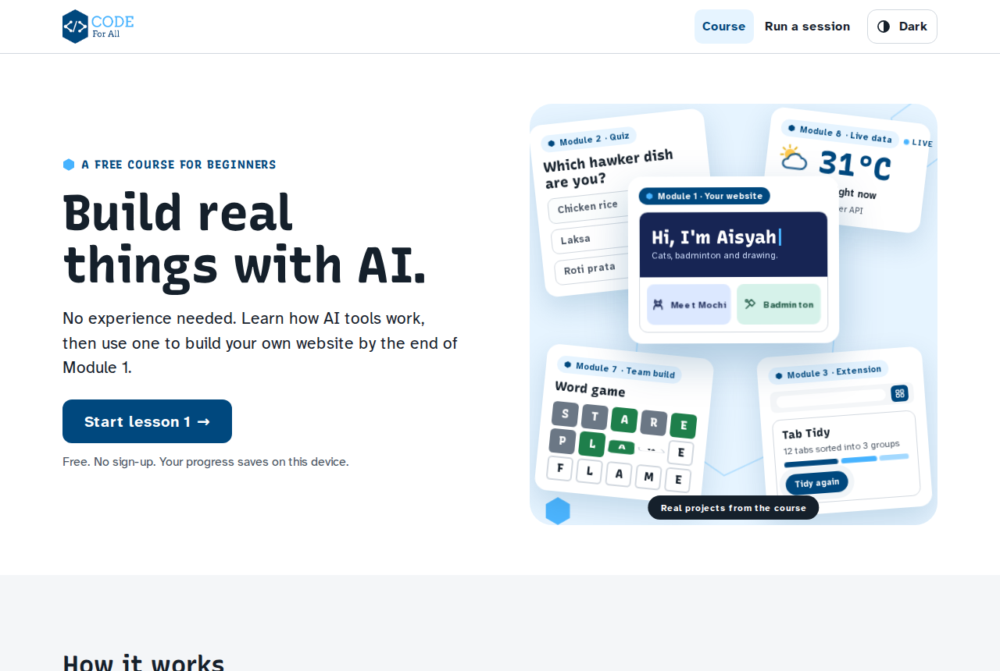
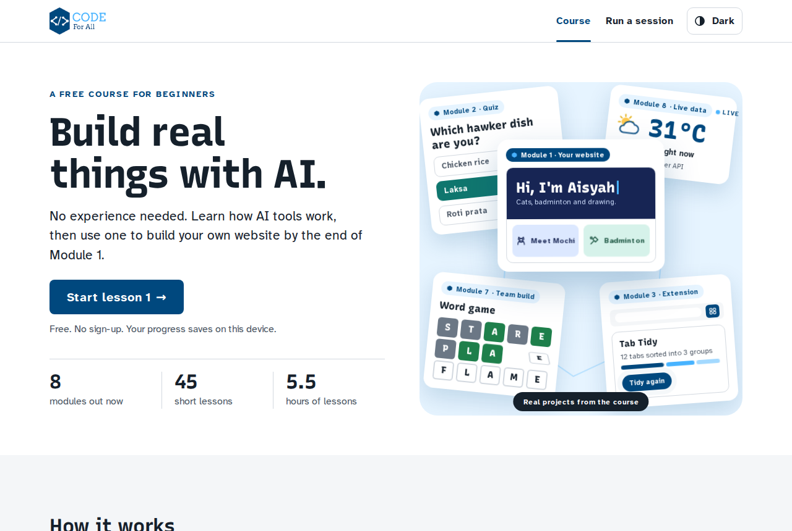
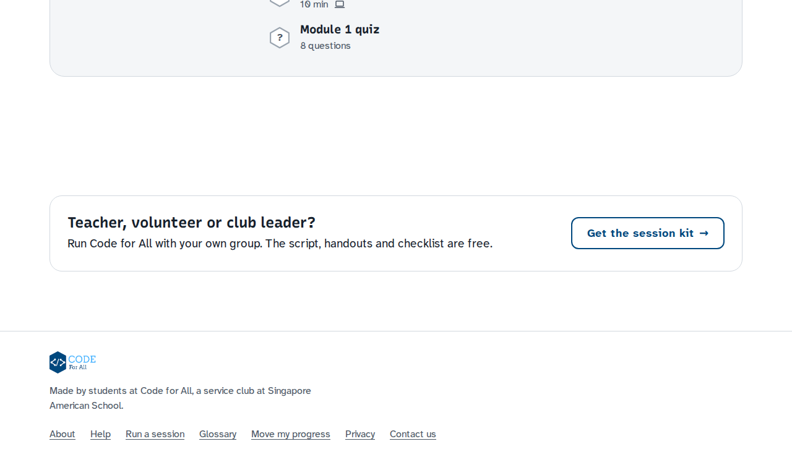
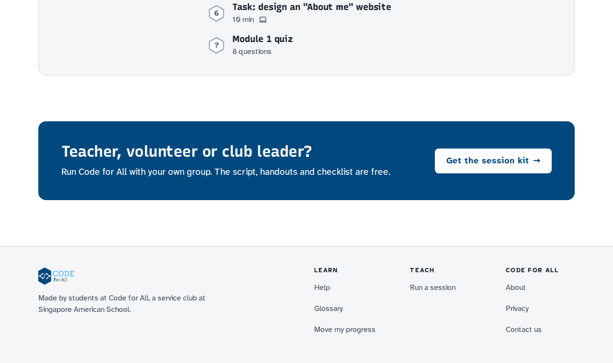
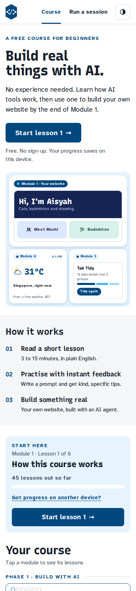
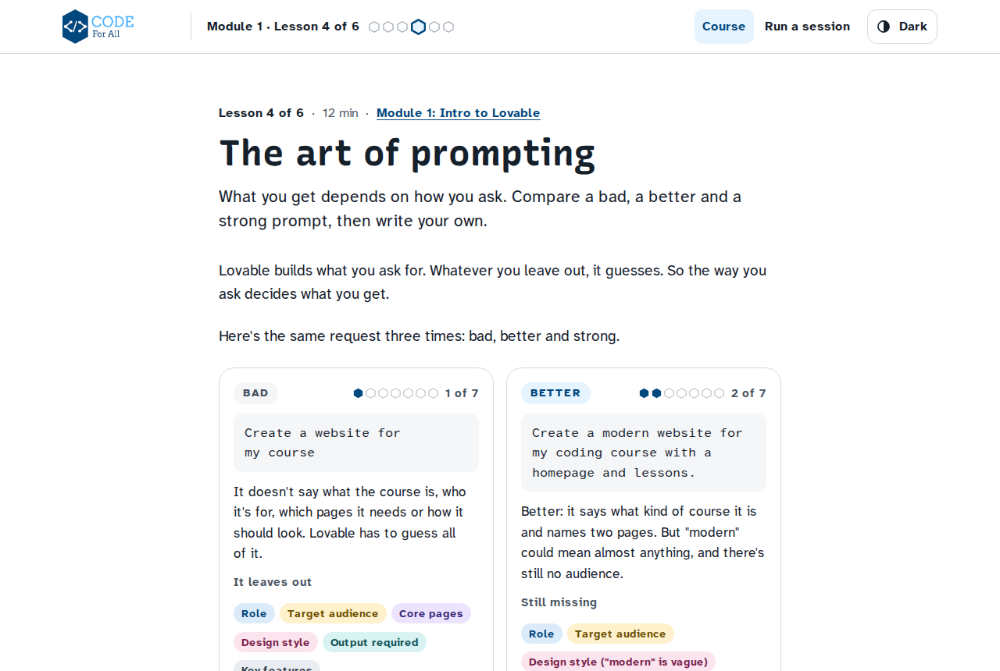
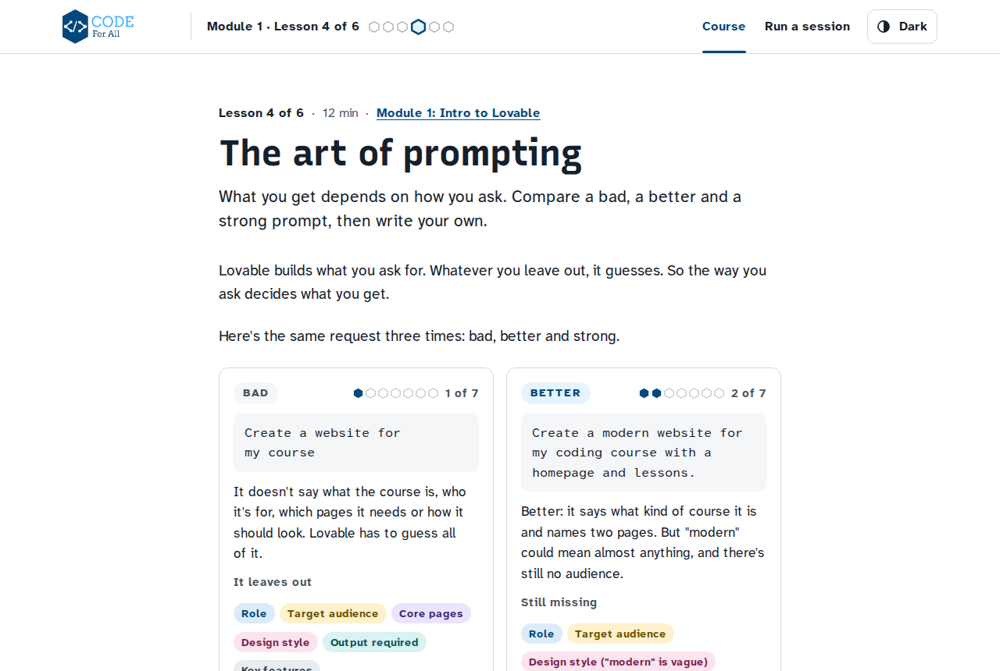
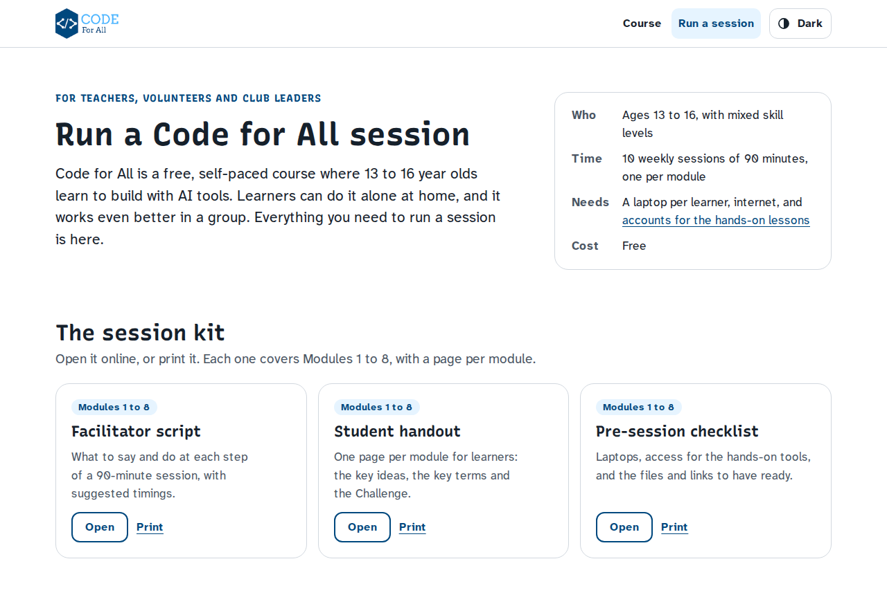
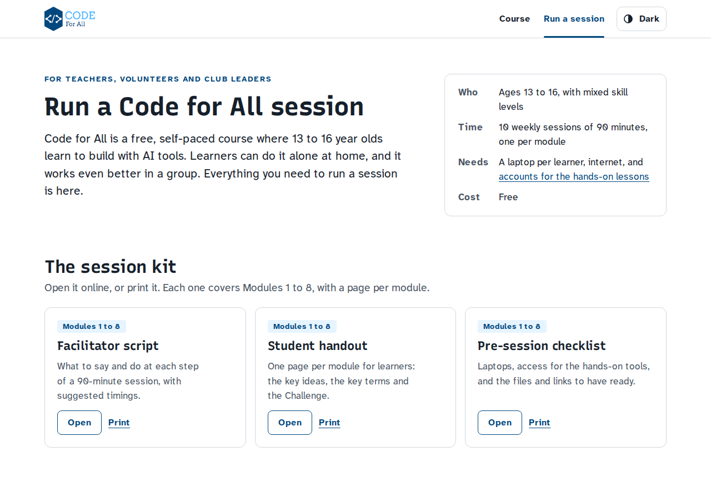

# Formal refresh: before and after

Light theme, same pages and widths before and after. Taken for the formal refresh pull request.

## Homepage, top (1280px)

| Before | After |
|---|---|
|  |  |

## Homepage, bottom (1280px)

| Before | After |
|---|---|
|  |  |

## Homepage, top two screens (390px)

| Before | After |
|---|---|
|  |  |

## Lesson 1.4, The art of prompting (1280px)

| Before | After |
|---|---|
|  |  |

## Run a session (1280px)

| Before | After |
|---|---|
|  |  |
