# Learner help: before and after

375px, light theme, full page. Taken for the learner-help pull request. Each page was also checked at 360px, 390px and 1280px in light and dark.

| Page | Before | After |
|---|---|---|
| Help (new) | |  |
| Hands-on access, with the device guide and cost | 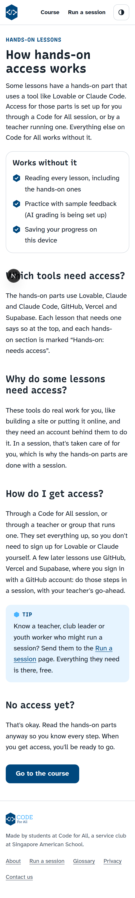 | 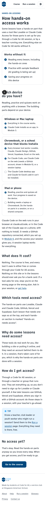 |
| 1.1 How this course works |  | 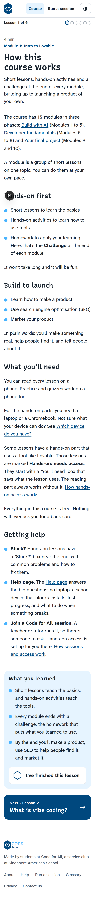 |
| 1.6 Task: design an About Me website (You'll need, saved prompt, safety) | 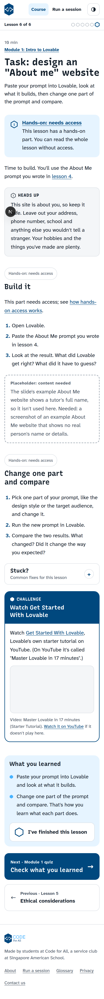 |  |
| 2.2 Solo sprint (Save it here) | 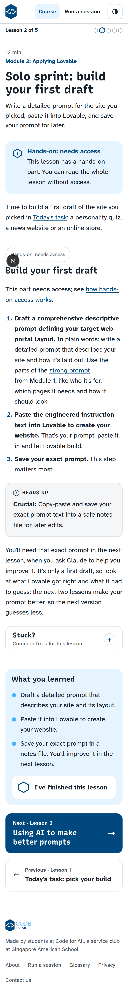 | 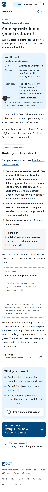 |
| 2.3 Using AI to make better prompts (saved work shown back) | 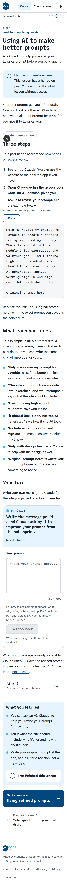 |  |
| 3.3 Task: install Claude Code (device note, Stuck box, Help link) |  |  |
| 6.6 Step 2: connect to Vercel (cost, safety) | 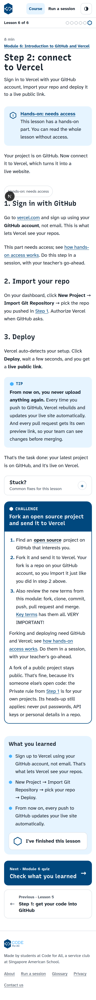 | 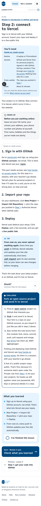 |
| 8.5 Creating login with Supabase (test email, safety) | 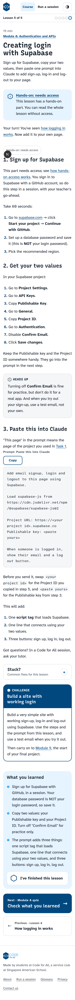 |  |
| Glossary (now includes inline terms) | |  |
