# Lesson visuals: before and after

375px, light theme, full page. Taken for the lesson-visuals pull request. Every new diagram was also checked on its own at 360px in dark mode and 1280px in light mode.

| Lesson | Before | After |
|---|---|---|
| 1.1 How this course works | 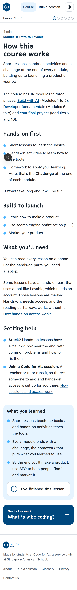 | 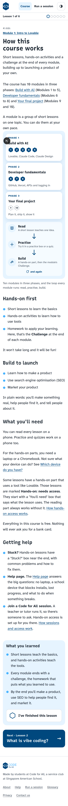 |
| 1.5 Ethical considerations | 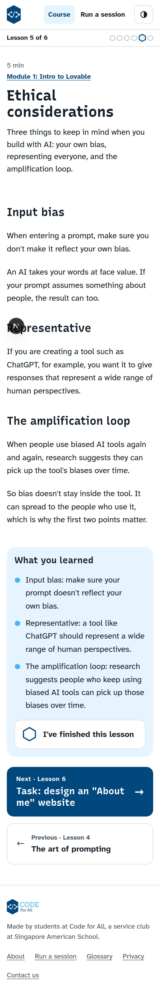 | 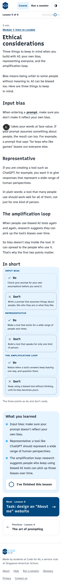 |
| 2.1 Today's task | 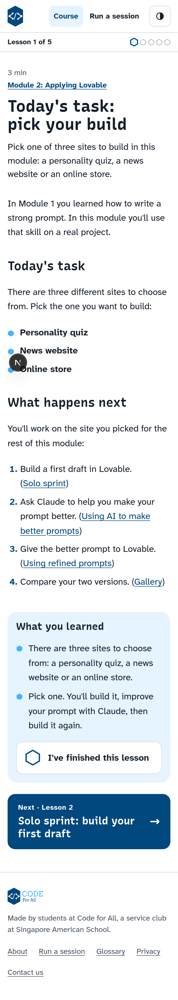 | 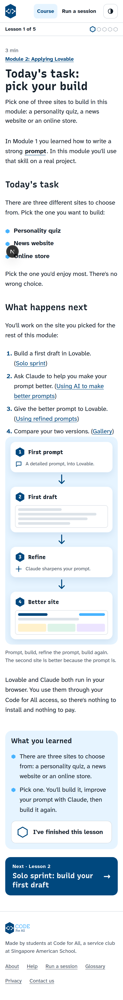 |
| 2.5 Gallery | 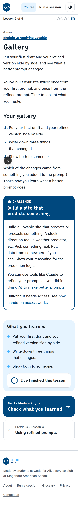 | 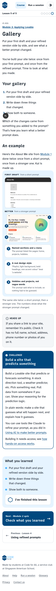 |
| 3.1 What is Claude Code? | 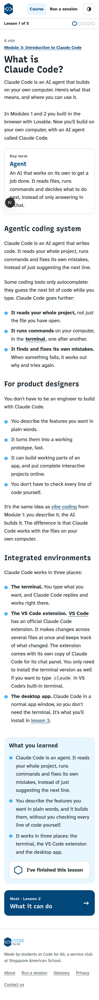 | 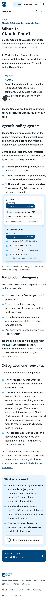 |
| 3.5 Plan your Chrome extension | 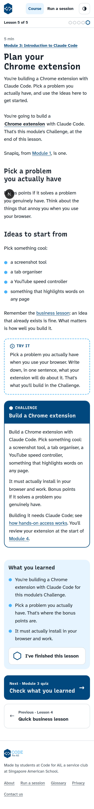 | 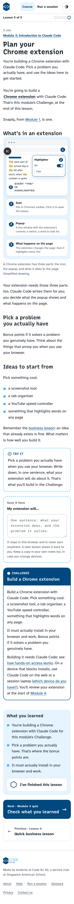 |
| 4.2 What are Claude Skills? | 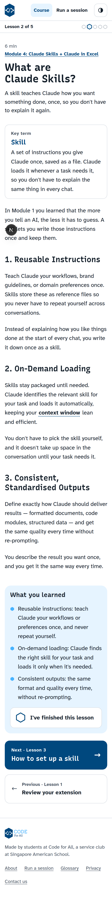 | 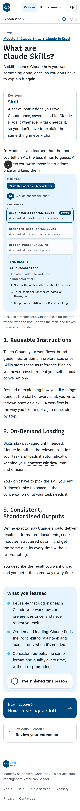 |
| 6.2 Key terms | 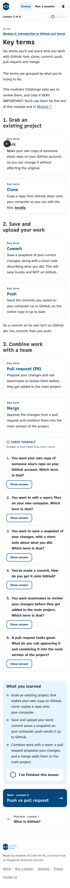 |  |
| 6.3 Push vs pull request | 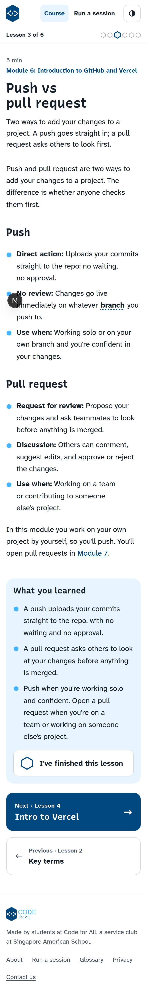 | 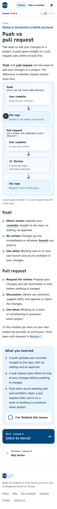 |
| 7.2 Branch vs fork | 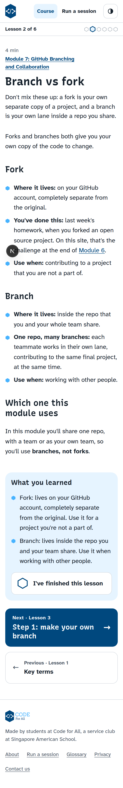 | 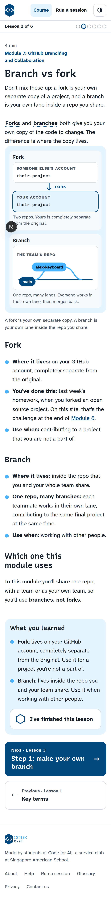 |
| 8.1 Two things your site still can't do | 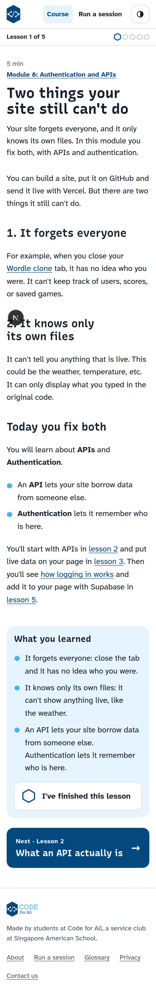 | 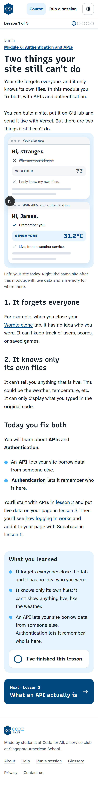 |

The "before" screenshots are from main. The other lessons with new diagrams (2.2, 2.3, 3.2, 5.5, 6.5, 6.6, 7.4) were checked the same way.
